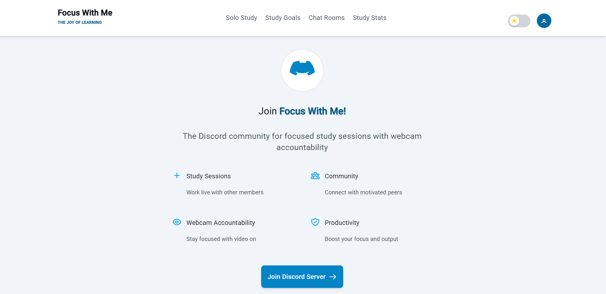

# 🎯 Focus With Me

> **Focus With Me** is a web application that helps students and professionals improve their concentration through real-time intelligent analysis and an interactive dashboard.

---

## 🚀 Aperçu du projet

The application leverages computer vision and artificial intelligence to analyze the user’s concentration level using the webcam.
It provides an intuitive web dashboard that displays clear statistics and trends showing how concentration evolves over time.
---

## ✨ Key Features

* 🔍 ** Real-time Focus Analysis**

  * Detects behaviors related to loss of attention such as distractions or lack of focus.

* 📊 **Interactive Dashboard**

  * Displays charts and graphs showing concentration trends.

* 🤝 **Virtual Coworking**

  * Join a virtual workspace to focus alongside other users.

* 🤖 **Smart Assistant**

  * Offers personalized advice based on concentration data.

---

## 🖼️ Captures d’écran

| Home Page                        | Dashboard                               | Collaborative Space                  |
| -------------------------------- | --------------------------------------- | ------------------------------------ |
|  |  |  |

---

## 🎥 Démo vidéo

👉[Watch the demo on YouTube](https://www.youtube.com/watch?v=fUE1tAz2DtE&t=62s)


---

## 🛠️ Technologies Used

* **Frontend** : Angular, TailwindCSS
* **Backend** : Python (FastAPI)
* **IA / Vision par ordinateur** : PyTorch, OpenCV (focus level detection)
* **Base de données** : Mongodb
* **Autres** : Chart.js / Recharts for data visualization

---

## ⚙️ Installation & Setup

### Clone the project

```bash
git clone https://github.com/Trikiwassim01/Focus_With_ME.git
cd focus-with-me
```

### Install and run the frontend

```bash
cd frontend
npm install
ng serve
```

### Install and run the backend

```bash
cd backend
pip install -r requirements.txt
uvicorn main:app --reload
```

---

## 📊 Future Improvements

* Gamification with points and badges.
* Calendar integration (Google Calendar, Outlook).
* Improved model accuracy for focus detection.
* Responsive mobile version.

---

## 👨‍💻 Author

Developed by **Wassim Triki**

* 📧 Email : [wassimtriki098@gmail.com](wassimtriki098@gmail.com)
* 💼 [LinkedIn] ([https://www.linkedin.com/in/wassim-triki-7a18702a4/](https://www.linkedin.com/in/wassim-triki-7a18702a4/))


